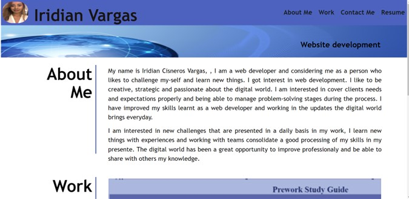
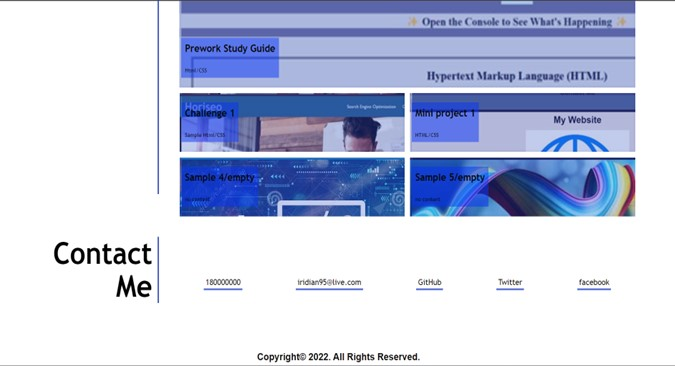

# My portfolio #

Table of Contents
1. About the proyect
2. Installation
3. Usage
4. Credits
5. License

## About the project ##

 The main purpose of this project is my main tool to introduce myself in the working world through my portfolio, it will show people my work done through the time and the avilities and skills I have as a web developer. It is an important aspect to have at the moment of an interviw, it is relatively my resume but in a digital portfolio.

 ## Installation ##
 N/A

 ## Usage ##

 This portfolio helps others to navigate through my personal information as a description of my self in the main page.

 At the top of the page there are 4 sections : 
 - About Me
 - Work
 - Contact Me
 - Resume

These 4 sections at the top help people to know about me , my work experience will be in the "work" section, it is attatched to websites I have done once we click on their img and it will send you directly to another page that I have built. My contact information is available in "Contact" and my Resume is not available in the portfolio yet. 

**Evidence of my portfolio with images**

-link to deployed application: 
[portfolio webpage.](https://naidiri1.github.io/Portfolio-Iris/#contactme)

## Credits ##
N/A

## License ##
N/A